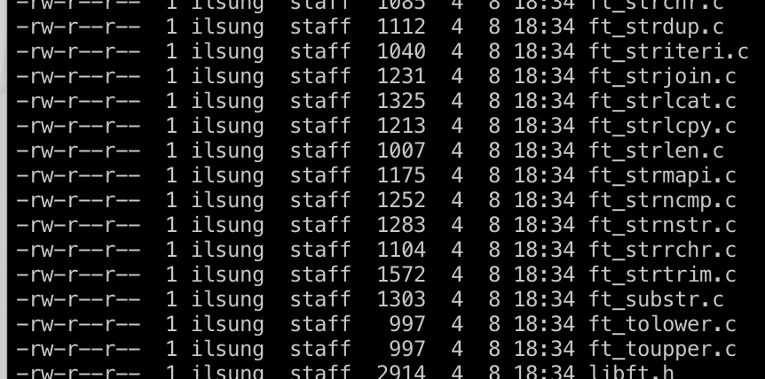

#### 과제 목적

42seoul 본과정 첫 과제.  
c언어의 기본적인 함수들을 직접 구현하고 나만의 라이브러리를 만드는 과제다.

비교적 간단한 <string.h>에 있는 strlen 함수부터 이해가 어려워서 머리를 아프게했던 strlcat, 다른 언어에는 기본적으로 있기도 하는 split 함수 등등.  
strlen처럼 간단한 함수는 c의 문법을 잘 이용해서 간결하고 읽기 쉬운 코드가 무엇일까 고민을 하느라 시간을 썼다.  
지금 생각해보면 별 것도 아닌 고민들 같지만 그런 고민들 덕에 항상 코드를 짤 때마다 어떤 방법이 더 간결하고, 가독성 좋고 효울이 좋을까 고민을 할 수 있게돼서 의미가 크다.  
출력을 버퍼 없이 write함수로 일일이 아스키값 문자 단위로 생각을 해야하고, 메모리 할당 실패에 대한 에러 핸들링 등 때문에 내 머리마저 굉장히 로우해지는 느낌을 받았다.  

과제 보너스는 연결리스트를 구현해서 이것저것 함수를 만들었다.  
자료구조에 대해서는 이론조차 미약하게만 알고있어서 이렇게 효율적인 방법이 있구나 신기했다.  
여러가지 방법으로 테스트 해보면서 포인터를 어떻게 활용해야할지, 포인터의 장단점을 익힐 수 있는 기회였다.

추가로 정적 라이브러리로 만들어야 했기 때문에 라이브러리가 어떻게 동작하는지, Makefile을 통한 컴파일을 더 효율적으로 할 수있는 것을 배웠다.

이후 과제에서 이 libft 라이브러리를 이용할 수 있는 과제들이 있었지만 나는 그냥 매 과제마다 필요한건 바로바로 구현했다.

아주 기초적이라고 생각하지만 요즘 시대에 이 정도의 저수준을 경험하는게 맞나 의문이 많이 들었었지만 후에 돌아보니 성장한게 보여서 자신감이 생겼다.